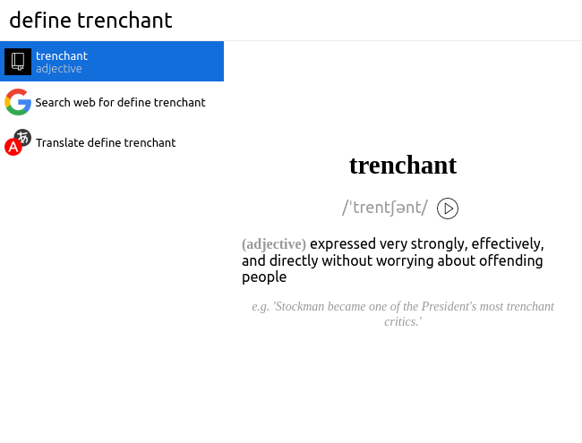

# Cerebro-Define

> A Cerebro plugin to quickly look up the meaning of a word

## Usage
Type `define ` and any word you'd like to search, the definition of the words found will be displayed in the results panel.

## Features

* Search for a word's definition, cross-platform
* Select a preview to get an usage example and listen to the pronunciation if available

## Related

* [Cerebro](http://github.com/KELiON/cerebro) – main repo for Cerebro app;

## License

MIT © [Gabriel Jauregui](https://github.com/glja021)